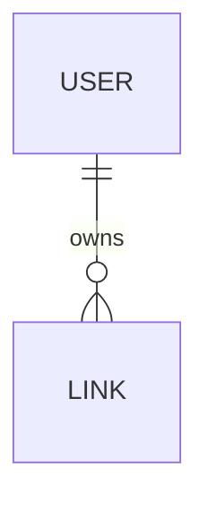

# Case Study — Shipping `lnk.sh` with Nexa Agentic Engineering

> A real working URL shortener, built end-to-end by an AI agent following a structured methodology. Every input and every artifact is shown verbatim. No edits, no after-the-fact polish.

**Status:** In progress · last updated 2026-04-26
**Repo:** [`docs/lead-magnet/nexa-starter-shortener/`](./nexa-starter-shortener/)

---

## Who this is for

You lead engineering at a 5–50 person team. You've adopted Claude Code (or Cursor, Copilot, Aider) and the productivity story looked great in the demo. In practice:

- Your senior engineers are reviewing 200-line AI-generated PRs that take 4 hours to read because the agent silently invented a "helper" abstraction nobody asked for.
- Your specs and your code drift apart by week two of any sprint, because the spec was a Notion doc and the agent never re-reads it.
- Your tests pass. Production breaks anyway. The agent mocked the database layer that the bug lives in.
- Onboarding a new engineer to an AI-generated codebase is harder than onboarding to one written by a human team — there are no design docs, just commits.

**Nexa Agentic Engineering** is a methodology that fixes this by enforcing a workflow the AI agent cannot skip: requirements → entity model → diagrams → wireframes → use case specs → designs → implementation → tests → evaluation. Every artifact is generated, machine-checked, and traceable.

This case study is the proof: an agent shipping a real product, every artifact shown.

---

## The product

`lnk.sh` — a privacy-respecting URL shortener with three actors and three delivered use cases. Small enough to read in one sitting, rich enough to demand a real entity model and non-trivial business rules (rate limits, slug collisions, anonymous expiry, abuse blocklist).

Three use cases shipped:

- **UC-001** — Link Owner views their links
- **UC-002** — Anonymous Visitor shortens a URL (hero use case)
- **UC-003** — Anonymous Visitor follows a short link

Stack: Next.js 15 (App Router) · Prisma · PostgreSQL · Vitest + Testcontainers · Playwright · next-intl · AWS App Runner.

---

## The five failure modes Nexa prevents

| # | Failure mode | What it looks like | Where Nexa intercepts it |
|---|--------------|--------------------|--------------------------|
| 1 | **Silent assumptions** | Agent guesses what "user" means and ships the wrong domain model | `/requirements` + `/entity-model` |
| 2 | **Spec amnesia** | Agent forgets the spec mid-implementation and invents new behavior | `/use-case-spec` re-read on every implement step |
| 3 | **Phantom abstractions** | Agent introduces a `BaseRepository<T>` for a single repository | `/code-review` + simplicity rule in CLAUDE.md |
| 4 | **Verification theater** | Tests pass, feature broken; mocked everything that matters | `/vitest-test` (Testcontainers) + `/playwright-test` |
| 5 | **Scope drift** | A bug fix turns into a 600-line refactor | `/code-review` enforces surgical scope |

Each phase below ends with a **What just happened** callout naming the failure mode it prevented.

---

## The build, phase by phase

### Phase 1 — Setup · `/setup-project-rules`

**Input:** an empty directory.
**Output:** [`CLAUDE.md`](./nexa-starter-shortener/CLAUDE.md) — six non-negotiable rules written into the project. The agent now cannot bypass the workflow, jump to implementation, duplicate use case numbers, or write code on `main`.

The rules are enforced on every skill invocation by the **Nexa Rules Gate**. Removing the marker disables the skills.

> **What just happened:** the agent's *future* shortcuts are physically blocked. No discipline, no willpower — the methodology is configuration.

---

### Phase 2 — Inception · `/requirements`

**Input:** [`docs/vision.md`](./nexa-starter-shortener/docs/vision.md) — a 30-line product vision (problem, goals, non-goals, success metrics, constraints).

**Output:** [`docs/requirements.md`](./nexa-starter-shortener/docs/requirements.md) — three tables:

- **4 Functional Requirements** (FR-001…FR-004), each in user-story form, each mapped to a use case ID
- **11 Non-Functional Requirements** (NFR-001…NFR-011), each measurable (p95 < 200ms, ≥ 80% coverage, Argon2id ≥ 64MB, etc.)
- **7 Constraints** (C-001…C-007), each technical or business

Every row passes the Nexa quality gate: singular, measurable, unambiguous, testable, unique ID. No prose. No "the system should be fast."

> **What just happened:** Failure mode #1 (silent assumptions) cannot occur. There is now a machine-readable record of *exactly* what the system does and does not do. If the agent later proposes building "an analytics dashboard," the gate rejects it — there is no FR for it.

---

### Phase 3 — Elaboration · `/entity-model`

**Input:** [`docs/requirements.md`](./nexa-starter-shortener/docs/requirements.md).

**Output:** [`docs/entity_model.md`](./nexa-starter-shortener/docs/entity_model.md) — a Mermaid ER diagram and an attribute table for each entity.

Two entities: **USER** (link owners) and **LINK** (shortened URLs). Every attribute has a data type, length, and validation rules. Multi-column constraints (anonymous links must have `expiresAt = createdAt + 30 days`; owned links must have `expiresAt = null`) are listed below the table.

This is not a prose description of the model — it is a structured input that the implementation phase consumes directly.

> **What just happened:** Failure mode #1 (silent assumptions) cannot leak into the data layer. The schema is locked. When `/prisma-migration` runs later, it has a single source of truth instead of inferring shape from "looks like there should be a User table."

---

### Phase 4 — Elaboration · `/use-case-diagram`

**Input:** [`docs/requirements.md`](./nexa-starter-shortener/docs/requirements.md) and the entity model.

**Output:** [`docs/use_cases.puml`](./nexa-starter-shortener/docs/use_cases.puml) — a PlantUML diagram with two actors, three user-facing use cases, and one technical task.

- Anonymous Visitor → UC-002 (Shorten), UC-003 (Redirect)
- Link Owner → UC-001 (List), UC-002 (Shorten as authenticated)
- UC-001 `<<requires>>` TT-001 (Auth middleware)

Each use case is annotated with the FR IDs it traces back to. The diagram is the canonical source of "what use cases exist" — every downstream skill (`/use-case-spec`, `/sprint-prepare`, `/sprint-deliver`) reads it to find the next ID to assign and to detect duplicates.

> **What just happened:** Failure mode #5 (scope drift) is now a structural impossibility. The agent cannot invent a UC-099 mid-sprint — the gate checks the diagram and rejects unknown IDs.

---

### Phase 5 — Elaboration · `/generate-wireframe`

**Input:** the use case diagram, requirements catalog, and entity model.

**Output:** [`docs/wireframes/index.html`](./nexa-starter-shortener/docs/wireframes/index.html) — a single HTML file with production-grade visual design.

The agent committed to a bold aesthetic direction (midnight + electric lime, Bricolage Grotesque + Manrope), built two interactive-looking screens (UC-002 hero + UC-001 dashboard), explicitly noted UC-003 has no UI (it's a 302 redirect), and wired up internal anchor navigation between screens. Realistic placeholder data drawn from the entity model: a `maria@example.com` link owner with slugs like `launch-2026`, `cv`, `talk-london`.

The wireframe is *not* a gray box-and-arrow sketch. It looks like something a designer made — because the methodology demands that. A weak wireframe produces weak downstream designs.

> **What just happened:** Failure mode #1 again — but this time on the UI/UX axis. By committing to a visual identity early, the agent avoids the "every screen is a slightly different gray rectangle" pattern that AI-generated UIs default to. `/design-screens` will inherit the typography, palette, and component vocabulary from this file, producing per-screen designs that are visually coherent.

---

---

### Phase 6 — Construction · `/use-case-spec` (×3)

**Input:** the wireframe, requirements, entity model, and use case diagram.

**Output:** three structured specs in [`docs/use_cases/`](./nexa-starter-shortener/docs/use_cases/):

- [`UC-001.md`](./nexa-starter-shortener/docs/use_cases/UC-001.md) — List my links · 4 alternative flows
- [`UC-002.md`](./nexa-starter-shortener/docs/use_cases/UC-002.md) — Shorten a URL · 5 alternative flows · 4 business rules
- [`UC-003.md`](./nexa-starter-shortener/docs/use_cases/UC-003.md) — Redirect to destination · 4 alternative flows · 4 business rules · behavior matrix

Each spec follows the same structure: Overview · Preconditions · Main Success Scenario (numbered steps) · Alternative Flows (each with trigger and step-by-step recovery) · Postconditions · Business Rules · Non-Functional · Traceability (back to FR/NFR/entity).

These are not "user stories" or one-paragraph blurbs. They are step-by-step machine-checkable specifications. The implementation phase will read them line by line.

> **What just happened:** Failure mode #2 (spec amnesia) is structurally prevented. When the agent enters implementation, it reads the spec at every iteration. Every alternative flow becomes a code path with a corresponding test. Nothing is "remembered" — everything is referenced.

---

### Phase 7 — Construction · `/design-screens` (×3)

**Input:** each use case spec + the wireframe.

**Output:**

- **Theme infrastructure** ([`docs/designs/`](./nexa-starter-shortener/docs/designs/)) — `current-theme.css` and `current-tailwind-config.js` are the active theme; `shore-theme-001.css` and `shore-tailwind-config.js` are the actual theme files. Swap the @import to retheme every screen at once.
- **3 design HTMLs**:
  - [`UC-001-design.html`](./nexa-starter-shortener/docs/designs/UC-001-design.html) — 4 states (loaded, empty, loading skeleton, session-expired)
  - [`UC-002-design.html`](./nexa-starter-shortener/docs/designs/UC-002-design.html) — 6 states (default, submitting, success, invalid URL, slug taken, blocklist + rate-limit) + data mapping table
  - [`UC-003-design.html`](./nexa-starter-shortener/docs/designs/UC-003-design.html) — success path (HTTP-only, no UI) + 404 + 410 + 451 + behavior matrix

Every state is annotated with the spec step it implements, the data it reads/writes, and design rationale. Designs reference the entity model — fields, types, validation rules — directly. There is no daylight between spec and design.

> **What just happened:** Failure mode #1 (silent assumptions) and #4 (verification theater) are constrained by structure. When the implementation phase begins, every visible state has a design that names the spec step. The Playwright tests later will assert the same set of states.

---

---

### Phase 8 — Construction · `/sprint-kickoff` + `/sprint-deliver`

> *Coming next.*

---

### Phase 9 — Verification · `/code-review` and `/evaluate`

> *Coming next.*

---

### Phase 10 — Completion · `/sprint-complete`

> *Coming next.*

---

## Result

> *Will be populated when the sprint completes. Expected metrics:*
>
> - 3 use cases shipped
> - X total LoC across `src/`
> - Y % integration coverage (Vitest + Testcontainers)
> - Z Playwright E2E scenarios, all green
> - 1 PR merged to `main` with a green CI matrix
> - Wall-clock time elapsed: TBD

---

## What this means for your team

If a single AI agent following the Nexa methodology can ship a working, tested, deployable product with every artifact traceable to a requirement — your team can do the same on real features, every sprint.

The two questions to ask yourself:

1. **How much of your current AI-generated code can you trace back to a written, agreed-upon spec?** If the answer is "none" or "the PR description," you have a Failure Mode #2 problem. Nexa fixes it.
2. **How much time does your team spend reviewing AI PRs vs. shipping?** If review is dominating, you have a Failure Mode #3 + #5 problem. Nexa caps the agent's freedom to invent.

---

## Try it

| Tier | Plugin | Covers | Price |
|------|--------|--------|-------|
| Free | `nexa-claude-core` | Inception → Use case spec → Design | Free |
| Paid | `nexa-claude-nextjs` | Implementation → Test → Sprint delivery | Paid |

Install the free plugin, fork [`nexa-starter-shortener`](./nexa-starter-shortener/), and run `/sprint-prepare` on your own product idea. When you hit the implementation step, you'll know what to do.
