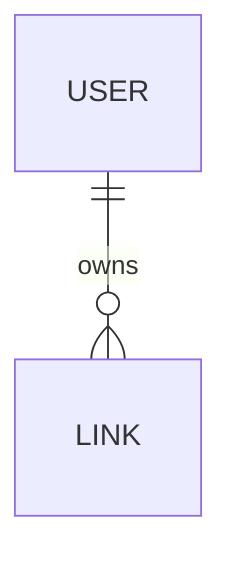

# Entity Model

Source: [`requirements.md`](./requirements.md)

The shipped scope (UC-001/002/003) requires two entities: **USER** (link owners) and **LINK** (shortened URLs). All business rules from the requirements catalog are enforced as attribute-level or table-level constraints below.

## Entity Relationship Diagram

### USER

A registered link owner who can claim links to keep them permanent and view them in a dashboard.

| Attribute    | Description                                        | Data Type | Length/Precision | Validation Rules        |
|--------------|----------------------------------------------------|-----------|------------------|-------------------------|
| id           | Unique identifier                                  | Long      | 19               | Primary Key, Sequence   |
| email        | Login identifier and contact address                | String    | 320              | Not Null, Unique, Format: Email |
| passwordHash | Argon2id-encoded password (≥ 64MB memory cost)      | String    | 200              | Not Null                |
| createdAt    | When the account was created                        | DateTime  | -                | Not Null                |
| updatedAt    | When the account was last modified                  | DateTime  | -                | Not Null                |

### LINK

A shortened URL pointing to a destination. May be anonymous (no `ownerId`, expires after 30 days) or owned (no expiry).

| Attribute      | Description                                              | Data Type | Length/Precision | Validation Rules                |
|----------------|----------------------------------------------------------|-----------|------------------|---------------------------------|
| id             | Unique identifier                                        | Long      | 19               | Primary Key, Sequence           |
| slug           | URL-safe token used as the short path                    | String    | 32               | Not Null, Unique, Min: 3, Max: 32 |
| destinationUrl | The full URL the short link redirects to                  | String    | 2048             | Not Null, Format: URL           |
| ownerId        | Reference to the link's owner (null for anonymous links)  | Long      | 19               | Optional, Foreign Key (USER.id) |
| creatorIp      | IP address of the creator, used for rate limiting         | String    | 45               | Not Null                        |
| expiresAt      | When the link expires (null for owned links)              | DateTime  | -                | Optional                        |
| createdAt      | When the link was created                                 | DateTime  | -                | Not Null                        |

**Constraints:**

- `slug` must match the regular expression `^[a-z0-9-]{3,32}$` (BR-01, FR-002).
- `expiresAt` must be exactly `createdAt + 30 days` when `ownerId` is null; `expiresAt` must be null when `ownerId` is not null (NFR-005).
- A unique database index on `slug` enforces uniqueness under concurrent writes (NFR-003).
- A composite index on `(creatorIp, createdAt)` supports the 20-links-per-hour rate-limit query (NFR-004).
- `destinationUrl` must use the `http` or `https` scheme (BR enforced at application layer; checked before insert).
