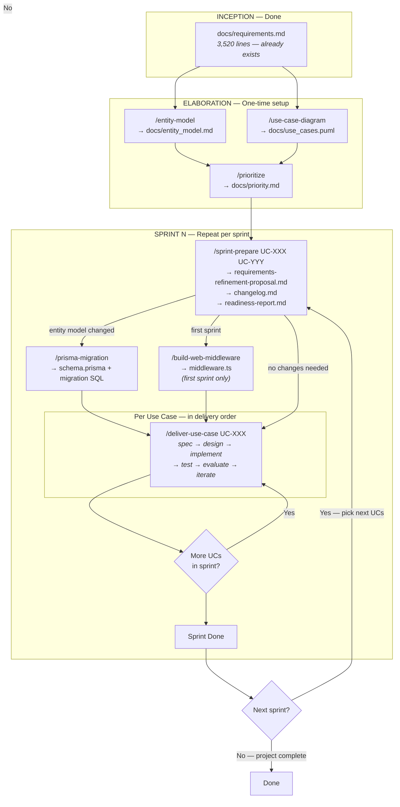

# VoluntX — Pipeline Overview

## Full Workflow Diagram

## Steps Summary

### Phase A: Elaboration (one-time, project-wide)

1. **`/entity-model`** — Produce entity model with Mermaid ER diagram and attribute tables
2. **`/use-case-diagram`** — Produce PlantUML use case diagram with all actors and use cases
3. **`/prioritize`** — Produce phased implementation order with dependency graph

### Phase B: Sprint Loop (repeat per sprint)

4. **`/sprint-prepare UC-XXX UC-YYY ...`** — Select, refine, validate, generate specs and designs
5. **`/prisma-migration`** — Generate DB migration if entity model changed
6. **`/build-web-middleware`** — Set up auth/RBAC/security middleware (first sprint only)
7. **`/deliver-use-case UC-XXX`** — For each UC in delivery order: implement, test, evaluate, iterate
8. **Repeat** step 7 for each UC in the sprint
9. **Go back** to step 4 for the next sprint
