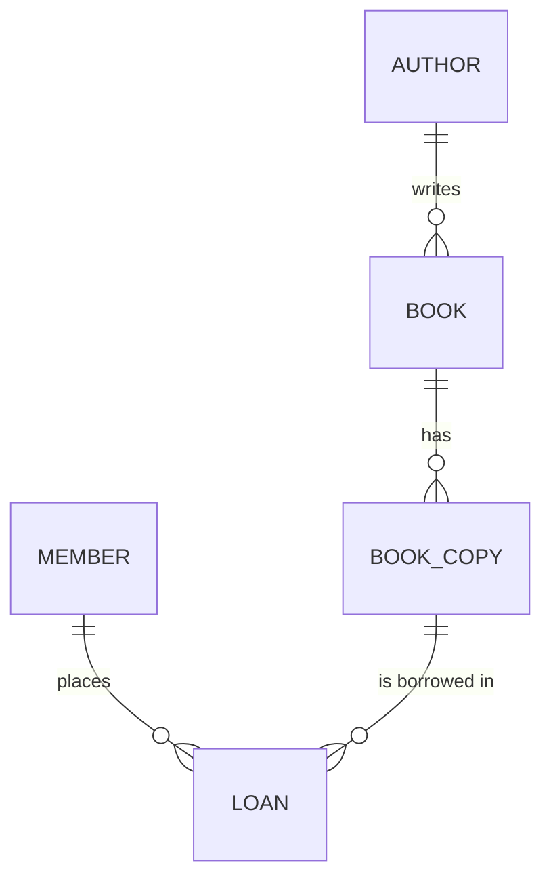

# Entity Model

## Entity Relationship Diagram

### MEMBER

A person registered with the library who can borrow copies.

| Attribute | Description              | Data Type | Length/Precision | Validation Rules        |
|-----------|--------------------------|-----------|------------------|-------------------------|
| id        | Unique identifier        | Long      | 19               | Primary Key, Sequence   |
| full_name | Full name of the member  | String    | 100              | Not Null                |
| email     | Contact email address    | String    | 255              | Not Null, Format: Email |

### AUTHOR

A person who has written one or more books.

| Attribute | Description       | Data Type | Length/Precision | Validation Rules      |
|-----------|-------------------|-----------|------------------|-----------------------|
| id        | Unique identifier | Long      | 19               | Primary Key, Sequence |
| full_name | Full name         | String    | 100              | Not Null              |

### BOOK

A catalogued title in the collection, written by one author.

| Attribute        | Description                | Data Type | Length/Precision | Validation Rules                 |
|------------------|----------------------------|-----------|------------------|----------------------------------|
| id               | Unique identifier          | Long      | 19               | Primary Key, Sequence            |
| title            | Title of the book          | String    | 255              | Not Null                         |
| isbn             | International book number  | String    | 17               | Not Null, Unique                 |
| publication_year | Year the book was published| Integer   | 10               | Not Null                         |
| author_id        | Author of the book         | Long      | 19               | Not Null, Foreign Key (AUTHOR.id)|

### BOOK_COPY

A physical copy of a book held by the library.

| Attribute | Description                  | Data Type | Length/Precision | Validation Rules                       |
|-----------|------------------------------|-----------|------------------|----------------------------------------|
| id        | Unique identifier            | Long      | 19               | Primary Key, Sequence                  |
| shelf_code| Shelf location code          | String    | 20               | Not Null                               |
| condition | Physical condition           | String    | 10               | Not Null, Values: New, Good, Worn      |
| book_id   | Book this copy belongs to    | Long      | 19               | Not Null, Foreign Key (BOOK.id)        |

### LOAN

A borrowing record linking a member to a copy for a period.

| Attribute   | Description                   | Data Type | Length/Precision | Validation Rules                      |
|-------------|-------------------------------|-----------|------------------|---------------------------------------|
| id          | Unique identifier             | Long      | 19               | Primary Key, Sequence                 |
| borrow_date | Date the copy was borrowed    | Date      | -                | Not Null                              |
| due_date    | Date the copy is due back     | Date      | -                | Not Null                              |
| return_date | Date the copy was returned    | Date      | -                | Optional                              |
| member_id   | Member who borrowed the copy  | Long      | 19               | Not Null, Foreign Key (MEMBER.id)     |
| copy_id     | Copy that was borrowed        | Long      | 19               | Not Null, Foreign Key (BOOK_COPY.id)  |

**Constraints:** Due date must be on or after the borrow date.
