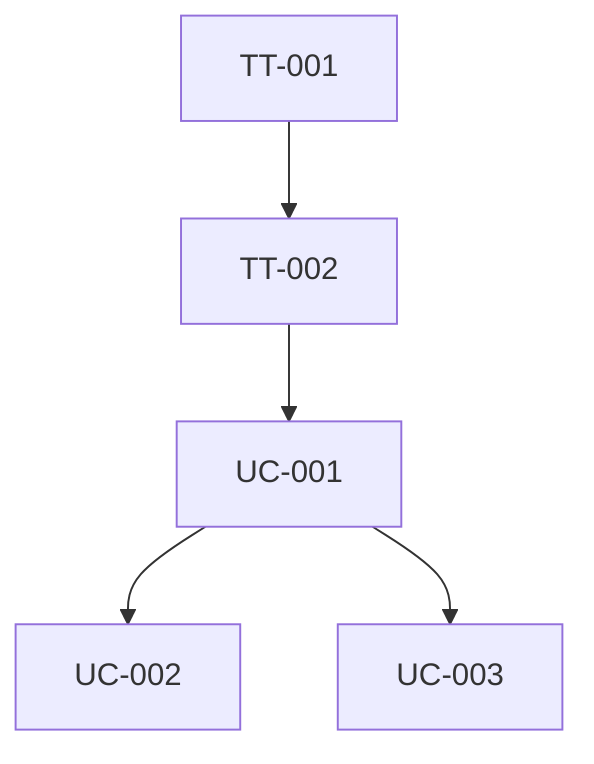

# Prioritize

## Instructions

Analyze all use cases in `docs/use_cases/` and technical tasks in `docs/technical_tasks/` to produce a prioritized implementation order. Write the result to `docs/priority.md`.

## DO NOT

- Prioritize without reading all existing specs first
- Ignore dependencies between items
- Rank items without stating the rationale
- Recommend implementing a use case before its prerequisite technical tasks
- Override explicit priority set by the user without flagging it

## Inputs

The skill reads these documents (all optional — work with whatever exists):

| Document                     | Purpose                                      |
|------------------------------|----------------------------------------------|
| `docs/requirements.md`      | Business priorities and requirement status    |
| `docs/entity_model.md`      | Entity dependencies between use cases        |
| `docs/use_cases.puml`       | Actor-to-use-case mapping                    |
| `docs/use_cases/*.md`       | Use case specs with preconditions and deps   |
| `docs/technical_tasks/*.md` | Technical tasks with dependencies            |

## Prioritization Criteria

Rank each item by evaluating these factors:

| Factor              | Weight | Description                                                                                   |
|---------------------|--------|-----------------------------------------------------------------------------------------------|
| Dependencies        | High   | Items that other items depend on must come first                                              |
| Foundation          | High   | Infrastructure and configuration tasks (DB setup, auth, profiles) precede feature work        |
| Business Value      | Medium | Higher-priority requirements (from requirements.md) rank higher                               |
| Risk                | Medium | Complex, uncertain, or integration-heavy items benefit from early implementation              |
| Entity Independence | Low    | Use cases touching fewer shared entities can be parallelized more easily                      |

## Output Format

Write `docs/priority.md` using this structure:

```markdown
# Implementation Priority

## Summary

Brief overview of the recommended strategy (2-3 sentences).

## Priority Order

### Phase 1: Foundation

Items that must be done first (infrastructure, configuration, core entities).

| # | ID     | Name                | Type | Rationale                        |
|---|--------|---------------------|------|----------------------------------|
| 1 | TT-001 | Set Up Dev Profile  | TT   | No other work can proceed without local dev environment |
| 2 | TT-002 | Database Migration   | TT   | All entities depend on DB schema |

### Phase 2: Core Features

Primary use cases that deliver the most business value.

| # | ID     | Name                | Type | Rationale                        |
|---|--------|---------------------|------|----------------------------------|
| 3 | UC-001 | Create Reservation  | UC   | Highest business priority, enables UC-002 |
| 4 | UC-002 | View Reservations   | UC   | Depends on UC-001 data           |

### Phase 3: Supporting Features

Secondary use cases and remaining tasks.

| # | ID     | Name                | Type | Rationale                        |
|---|--------|---------------------|------|----------------------------------|
| 5 | UC-003 | Generate Report     | UC   | Lower priority, needs UC-001/002 data |

## Dependency Graph

Visual representation of dependencies using Mermaid:



## Parallelization Opportunities

Items within the same phase that can be worked on simultaneously.

## Risks and Considerations

Notable risks, unknowns, or trade-offs in the recommended order.
```

## Workflow

1. Read all available input documents:
    - `docs/requirements.md`
    - `docs/entity_model.md`
    - `docs/use_cases.puml`
    - All files in `docs/use_cases/`
    - All files in `docs/technical_tasks/`
2. Use TodoWrite to track progress
3. Build a dependency graph:
    - Map technical task dependencies (from their Dependencies section)
    - Map use case preconditions to other use cases or technical tasks
    - Identify entity dependencies from the entity model
4. Evaluate each item against the prioritization criteria
5. Group items into phases (Foundation, Core Features, Supporting Features)
6. Identify parallelization opportunities within each phase
7. Write `docs/priority.md` with the full analysis
8. Validate:
    - Every UC and TT from the specs appears in the priority list
    - No item is scheduled before its dependencies
    - Rationale is provided for every item
9. Mark todo complete
