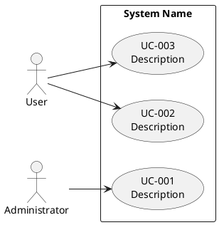

<!--
Copyright 2025-2026 Simon Martinelli and the AI Unified Process contributors.
Part of the AI Unified Process — https://unifiedprocess.ai
Licensed under the Apache License, Version 2.0. See LICENSE and NOTICE.

Modifications Copyright 2026 Nexa (nexadev.app).
This file is derived from the AI Unified Process Marketplace and has been
modified for the Nexa Agentic Engineering methodology.
-->

# Use Case Diagram

## Instructions

Create or update the PlantUML use case diagram at `docs/use_cases.puml` based on `docs/requirements.md`.

## DO NOT

- Create diagrams without reading the requirements first
- Use non-standard PlantUML syntax
- Include implementation details in use case names

## Nexa Rules Gate

Read and follow `${CLAUDE_PLUGIN_ROOT}/shared/readiness/NEXA_RULES_GATE.md`.

## Template



## Conventions

- Each use case has a unique id and a description
- Use Case ID: UC-{3-digit} (UC-001, UC-002, ...)
- **Technical Task ID: TT-{3-digit}** (TT-001, TT-002, ...) — for provisioning, infrastructure,
  or configuration work that a use case depends on but that has no user-facing scenario.
  Technical tasks are represented with a `<<technical>>` stereotype and dashed border.
  Use cases that depend on them use a dotted dependency arrow with a `<<requires>>` label.
  Example:
  ```plantuml
  usecase "TT-010\nProvision OAuth App" as TT010 <<technical>>
  UC045 ..> TT010 : <<requires>>
  ```
- **Use case dependencies** — when a use case cannot be delivered until another use case is
  done, draw the same dotted `<<requires>>` arrow between them:
  ```plantuml
  UC005 ..> UC003 : <<requires>>
  ```
  The diagram is the **visual mirror**. The authoritative declaration is the **Depends On** row
  in `docs/use_cases/UC-XXX.md` — that is what the delivery scheduler parses. Keep the two in
  agreement; when they disagree, the use case specification wins.
- Each use case should trace to at least one functional requirement
- Add notes sparingly, only where relationships need clarification

## Workflow

1. Read the requirements at `docs/requirements.md`
2. Read existing diagram at `docs/use_cases.puml` (if exists)
3. Identify actors and use cases from requirements
4. Create/update the PlantUML use case diagram
5. Validate the diagram:
    - Each use case traces to at least one functional requirement in `docs/requirements.md`
    - All actors are connected to at least one use case
    - Use case IDs follow the UC-{3-digit} convention
    - PlantUML syntax is valid (no missing `@enduml`, proper arrow syntax)